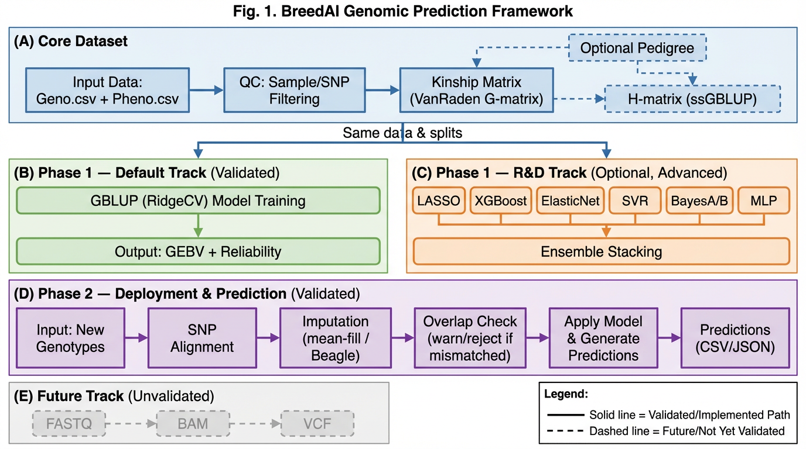

# Pipeline figure — caption and panel text

*Draft for one overview figure (e.g., two-row flow). Adjust panel labels to match final artwork.*

---

## Generated Figure

*Also available at: `images/breedai_pipeline_figure.png`*

---

## Suggested title (figure)

**Figure 1.** BreedAI workflow: shared core dataset with literature-aligned default track and optional R&D benchmarking; Phase 2 deployment with genotype alignment and overlap guardrails.

---

## Full caption (copy-paste)

**Figure 1. BreedAI end-to-end conceptual workflow (genotype-level validation path).**  
**(A)** Raw or public inputs: genotype matrices (and optional phenotype/metadata) enter a **core dataset** builder with sample/SNP QC, genotype matrix checks, VanRaden **G** matrix, optional **H**/ssGBLUP when pedigree exists (skipped in the cattle proof of concept), and fixed-effect specification. **(B)** **Phase 1 — Default track:** GBLUP (ridge on the genomic relationship kernel) with held-out evaluation and optional GEBV/reliability summaries. **(C)** **Phase 1 — Optional R&D track:** additional algorithms and ensembles on the **same** preprocessed data and splits when invoked from a unified run configuration. **(D)** **Phase 2 — Deployment:** new animals are aligned to training SNP order; missing genotypes are imputed (**Beagle** if enabled, else mean-fill); **SNP overlap** is computed and compared to warning/rejection thresholds; predictions and reports (CSV/JSON) are written. **(E)** **Out of scope for the current milestone:** FASTQ QC, alignment, and joint variant calling are represented as future extensions (stub modules only). Arrow thickness is schematic; not all species or pipelines are validated in the present manuscript.

---

## Panel-by-panel legend (for artist)

| Panel | Show                                                     | Label                 |
| ----- | -------------------------------------------------------- | --------------------- |
| A     | Box: inputs → QC → G matrix (+ dashed “pedigree → H”)    | “Core dataset”        |
| B     | Default track only                                       | “GBLUP (default)”     |
| C     | Many small model icons → one “ensembles” box             | “R&D (optional)”      |
| D     | New genotypes → align / impute → overlap % → predictions | “Phase 2 prediction”  |
| E     | Faded or dashed FASTQ → BAM → VCF                        | “FASTQ path (future)” |

---

## Color / semantics (optional)

- **Solid lines:** implemented and validated on cattle POC (genotype path, including R&D track).
- **Dashed lines:** optional (pedigree/ssGBLUP) or future (FASTQ path).

---

## What not to imply in the figure

- Do not depict a fully operational WGS pipeline as “validated” if the figure is for the current paper—use dashed or a “future work” inset.
- Do not suggest ssGBLUP results without a pedigree benchmark—the cattle POC uses **G** only.

